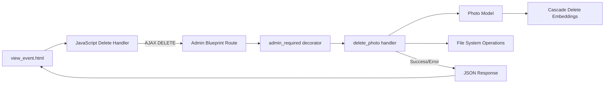

# Design Document: Photo Deletion Feature

## Overview

This document describes the design for adding photo deletion functionality to the PICME photo retrieval system. The feature enables administrators to delete individual photos from events through a web interface, with proper cascade deletion of associated data (face embeddings) and file system cleanup.

**Architecture Pattern**: The feature follows Flask's Model-View-Controller (MVC) pattern integrated with the existing application architecture:
- **Model**: Leverages SQLAlchemy's cascade deletion on the `Photo` model
- **View**: Adds a DELETE route in the admin blueprint
- **Controller**: JavaScript-based AJAX calls from the frontend with Bootstrap modal for confirmation

**Key Design Decisions**:
1. **Database-first deletion**: Delete from database first, then attempt file cleanup to ensure data integrity
2. **Graceful file failures**: If file deletion fails, log the error but complete the database transaction
3. **AJAX-based UI**: Delete without page reload for better user experience
4. **Cascade deletion**: Leverage SQLAlchemy relationships to automatically remove face embeddings

## Architecture

### System Context

```mermaid
graph TB
    Admin[Admin User] --> Browser[Web Browser]
    Browser --> Flask[Flask Application]
    Flask --> DB[(SQLite Database)]
    Flask --> FS[File System]
    
    subgraph "Photo Deletion Flow"
        Browser -->|DELETE Request| Route[/admin/photos/<id>/delete]
        Route --> Auth[Authorization Check]
        Auth -->|Authorized| DeleteLogic[Deletion Logic]
        DeleteLogic --> DB
        DeleteLogic --> FS
        DeleteLogic -->|JSON Response| Browser
    end
```

### Component Architecture

The feature integrates into the existing PICME architecture with minimal changes:



**Integration Points**:
- **Admin Blueprint** (`app/routes/admin.py`): New route handler for DELETE requests
- **Photo Model** (`app/models.py`): Existing cascade relationship already configured
- **View Template** (`app/templates/admin/view_event.html`): Add delete button and JavaScript
- **File System**: Direct `os.remove()` calls to delete photo files

## Components and Interfaces

### Backend Components

#### 1. DELETE Route Handler

**Location**: `app/routes/admin.py`

**Signature**:
```python
@admin_bp.route('/photos/<int:photo_id>/delete', methods=['DELETE'])
@login_required
@admin_required
def delete_photo(photo_id: int) -> tuple[Response, int]
```

**Responsibilities**:
- Verify admin authentication and authorization
- Retrieve photo record by ID
- Delete photo file from filesystem (with error handling)
- Delete photo record from database (triggers cascade deletion of embeddings)
- Return JSON response with success/error status

**Error Handling**:
- 404 if photo not found
- 403 if user not authorized
- 500 for unexpected errors
- Log file system errors but don't fail transaction

**Transaction Boundaries**:
```python
# Pseudo-code flow
try:
    photo = Photo.query.get_or_404(photo_id)
    
    # Attempt file deletion (log errors, don't fail)
    if os.path.exists(photo.filepath):
        try:
            os.remove(photo.filepath)
        except OSError as e:
            current_app.logger.error(f"File deletion failed for photo {photo_id}: {e}")
    
    # Database deletion (atomic transaction)
    db.session.delete(photo)
    db.session.commit()
    
    return jsonify({'success': True, 'message': 'Photo deleted'}), 200
except Exception as e:
    db.session.rollback()
    return jsonify({'success': False, 'error': str(e)}), 500
```

#### 2. Model Cascade Configuration

**Location**: `app/models.py` (already configured)

The existing `Photo` model already has cascade deletion configured:
```python
class Photo(db.Model):
    # ...
    embeddings = db.relationship('FaceEmbedding', backref='photo', 
                                lazy='dynamic', cascade='all, delete-orphan')
```

**Cascade Behavior**:
- When a `Photo` record is deleted, SQLAlchemy automatically deletes all associated `FaceEmbedding` records
- No additional code required; leverages existing relationship configuration

### Frontend Components

#### 1. Delete Button UI

**Location**: `app/templates/admin/view_event.html`

**Design Requirements** (from Requirement 7):
- Red color scheme for destructive action
- Trash icon for visual clarity
- Darker shade on hover
- Consistent positioning on all photo cards

**HTML Structure**:
```html
<div class="card h-100">
    
    <div class="card-body p-2">
        <!-- Existing content -->
        <button class="btn btn-danger btn-sm delete-photo-btn w-100 mt-2" 
                data-photo-id="{{ photo.id }}"
                data-photo-filename="{{ photo.filename }}">
            <i class="fas fa-trash"></i> Delete Photo
        </button>
    </div>
</div>
```

**CSS Styling**:
```css
.delete-photo-btn {
    background-color: #dc3545;
    border-color: #dc3545;
}

.delete-photo-btn:hover {
    background-color: #c82333;
    border-color: #bd2130;
}
```

#### 2. Confirmation Modal

**Location**: `app/templates/admin/view_event.html`

**Design Requirements** (from Requirement 8):
- Display photo filename
- Warning that action cannot be undone
- Cancel and Delete action buttons

**HTML Structure**:
```html
<div class="modal fade" id="deletePhotoModal" tabindex="-1">
    <div class="modal-dialog">
        <div class="modal-content">
            <div class="modal-header">
                <h5 class="modal-title">Confirm Photo Deletion</h5>
                <button type="button" class="btn-close" data-bs-dismiss="modal"></button>
            </div>
            <div class="modal-body">
                <p>Are you sure you want to delete <strong id="deletePhotoFilename"></strong>?</p>
                <p class="text-danger">This action cannot be undone.</p>
            </div>
            <div class="modal-footer">
                <button type="button" class="btn btn-secondary" data-bs-dismiss="modal">Cancel</button>
                <button type="button" class="btn btn-danger" id="confirmDeleteBtn">Delete</button>
            </div>
        </div>
    </div>
</div>
```

#### 3. JavaScript Delete Handler

**Location**: `app/templates/admin/view_event.html` (in `extra_js` block)

**Responsibilities**:
- Handle delete button click
- Show confirmation modal
- Send AJAX DELETE request
- Update UI on success (remove photo card)
- Display error messages on failure
- Update photo count statistics

**Implementation Pattern**:
```javascript
$(document).ready(function() {
    let currentPhotoId = null;
    let currentPhotoCard = null;
    
    // Delete button click handler
    $('.delete-photo-btn').click(function() {
        currentPhotoId = $(this).data('photo-id');
        currentPhotoCard = $(this).closest('.col-md-3');
        $('#deletePhotoFilename').text($(this).data('photo-filename'));
        $('#deletePhotoModal').modal('show');
    });
    
    // Confirm deletion
    $('#confirmDeleteBtn').click(function() {
        $.ajax({
            url: `/admin/photos/${currentPhotoId}/delete`,
            type: 'DELETE',
            success: function(response) {
                // Remove card from DOM
                currentPhotoCard.fadeOut(300, function() {
                    $(this).remove();
                    updatePhotoCount();
                });
                $('#deletePhotoModal').modal('hide');
                showSuccessMessage('Photo deleted successfully');
            },
            error: function(xhr) {
                $('#deletePhotoModal').modal('hide');
                showErrorMessage(xhr.responseJSON?.error || 'Failed to delete photo');
            }
        });
    });
});
```

## Data Models

### Existing Models (No Changes Required)

The existing data models already support the required cascade deletion behavior:

```python
class Photo(db.Model):
    __tablename__ = 'photos'
    
    id = db.Column(db.Integer, primary_key=True)
    filename = db.Column(db.String(256), nullable=False)
    filepath = db.Column(db.String(512), nullable=False)
    uploaded_at = db.Column(db.DateTime, default=datetime.utcnow)
    processed = db.Column(db.Boolean, default=False)
    num_faces = db.Column(db.Integer, default=0)
    event_id = db.Column(db.Integer, db.ForeignKey('events.id'), nullable=False)
    
    # Cascade delete embeddings when photo is deleted
    embeddings = db.relationship('FaceEmbedding', backref='photo', 
                                lazy='dynamic', cascade='all, delete-orphan')

class FaceEmbedding(db.Model):
    __tablename__ = 'face_embeddings'
    
    id = db.Column(db.Integer, primary_key=True)
    photo_id = db.Column(db.Integer, db.ForeignKey('photos.id'), nullable=False)
    model_type = db.Column(db.String(32), nullable=False)
    embedding_json = db.Column(db.Text, nullable=False)
    # ...
```

**Deletion Flow**:
1. Admin requests deletion of Photo with id=5
2. SQLAlchemy finds all FaceEmbedding records where photo_id=5
3. SQLAlchemy deletes all FaceEmbedding records first
4. SQLAlchemy deletes the Photo record
5. File system deletion attempted (logged if fails)

### File System Structure

**Photo Storage Pattern**:
```
app/static/uploads/events/
├── {event_id}/
│   ├── {event_id}_{timestamp}_{filename}.jpg
│   ├── {event_id}_{timestamp}_{filename}.jpg
│   └── ...
└── event_{event_id}_qr.png
```

**Deletion Pattern**:
- Construct file path from `photo.filepath` attribute
- Check if file exists before attempting deletion
- Log errors if deletion fails (permissions, file not found)
- Complete database transaction regardless of file deletion outcome

## Error Handling

### Error Categories and Responses

| Error Type | HTTP Status | Response Format | UI Behavior |
|------------|-------------|-----------------|-------------|
| Photo Not Found | 404 | `{"success": false, "error": "Photo not found"}` | Alert: "Photo not found" |
| Unauthorized | 403 | Redirect to login | Flash message + redirect |
| File System Error | 200 | `{"success": true, "message": "Photo deleted (file error logged)"}` | Success message |
| Database Error | 500 | `{"success": false, "error": "<details>"}` | Alert: "Database error: ..." |
| Network Error | N/A | AJAX error callback | Alert: "Network error" |

### Error Handling Strategy

**Backend Error Handling**:
```python
@admin_bp.route('/photos/<int:photo_id>/delete', methods=['DELETE'])
@login_required
@admin_required
def delete_photo(photo_id):
    try:
        photo = Photo.query.get_or_404(photo_id)
        
        # File deletion (non-critical)
        if os.path.exists(photo.filepath):
            try:
                os.remove(photo.filepath)
                current_app.logger.info(f"Deleted photo file: {photo.filepath}")
            except OSError as e:
                current_app.logger.error(f"Failed to delete file {photo.filepath}: {e}")
                # Continue with database deletion
        else:
            current_app.logger.warning(f"Photo file not found: {photo.filepath}")
        
        # Database deletion (critical)
        db.session.delete(photo)
        db.session.commit()
        current_app.logger.info(f"Deleted photo record: {photo_id}")
        
        return jsonify({'success': True, 'message': 'Photo deleted successfully'}), 200
        
    except Exception as e:
        db.session.rollback()
        current_app.logger.error(f"Error deleting photo {photo_id}: {str(e)}")
        return jsonify({'success': False, 'error': str(e)}), 500
```

**Frontend Error Handling**:
```javascript
$.ajax({
    url: `/admin/photos/${photoId}/delete`,
    type: 'DELETE',
    success: function(response) {
        // Remove from UI
        photoCard.fadeOut(300, function() { $(this).remove(); });
        showAlert('success', response.message);
    },
    error: function(xhr, status, error) {
        let errorMsg = 'Failed to delete photo';
        if (xhr.responseJSON && xhr.responseJSON.error) {
            errorMsg = xhr.responseJSON.error;
        } else if (status === 'timeout') {
            errorMsg = 'Request timed out';
        } else if (status === 'error') {
            errorMsg = 'Network error';
        }
        showAlert('danger', errorMsg);
    }
});
```

### Logging Requirements

**Log Entries** (from Requirement 6.4):
- Timestamp of deletion attempt
- Photo ID
- Admin user ID
- Outcome (success/failure)
- Error details if failed

**Log Format**:
```python
current_app.logger.info(f"[PHOTO_DELETE] user={current_user.id} photo={photo_id} status=success")
current_app.logger.error(f"[PHOTO_DELETE] user={current_user.id} photo={photo_id} status=error error='{str(e)}'")
```

## Testing Strategy

This feature requires a **dual testing approach** combining unit tests for specific scenarios and integration tests for end-to-end workflows. Property-based testing is **not applicable** for this feature because:

1. **Infrastructure Operations**: The feature primarily involves IaC-like operations (file system, database transactions)
2. **Side-Effect Operations**: Photo deletion is a side-effect-only operation with no return value to test universal properties on
3. **External Dependencies**: Tests involve database and file system state that are environment-specific

### Unit Testing Strategy

**Test Categories**:

1. **Authorization Tests** (from Requirement 1)
   - Test non-admin user receives 403 error
   - Test unauthenticated user redirects to login
   - Test authenticated admin can access endpoint

2. **Deletion Logic Tests** (from Requirement 2)
   - Test photo record is deleted from database
   - Test face embeddings are cascade deleted
   - Test file is removed from filesystem
   - Test missing file doesn't prevent database deletion
   - Test invalid photo ID returns 404

3. **File System Error Tests** (from Requirement 6)
   - Test permission errors are logged but don't fail transaction
   - Test invalid file paths are logged but don't fail transaction
   - Test database rollback on database errors

4. **Concurrent Deletion Tests** (from Requirement 9)
   - Test first deletion succeeds
   - Test second deletion returns 404
   - Test transaction atomicity

**Example Unit Tests**:

```python
# test_photo_deletion.py

def test_admin_can_delete_photo(client, admin_user, test_photo):
    """Admin successfully deletes a photo"""
    login(client, admin_user)
    response = client.delete(f'/admin/photos/{test_photo.id}/delete')
    assert response.status_code == 200
    assert Photo.query.get(test_photo.id) is None

def test_non_admin_cannot_delete_photo(client, regular_user, test_photo):
    """Non-admin user receives 403 error"""
    login(client, regular_user)
    response = client.delete(f'/admin/photos/{test_photo.id}/delete')
    assert response.status_code == 403

def test_cascade_deletes_embeddings(client, admin_user, test_photo_with_embeddings):
    """Deleting photo removes associated face embeddings"""
    embedding_ids = [e.id for e in test_photo_with_embeddings.embeddings]
    login(client, admin_user)
    client.delete(f'/admin/photos/{test_photo_with_embeddings.id}/delete')
    
    for embedding_id in embedding_ids:
        assert FaceEmbedding.query.get(embedding_id) is None

def test_missing_file_still_deletes_record(client, admin_user, test_photo):
    """Missing photo file doesn't prevent database deletion"""
    os.remove(test_photo.filepath)  # Remove file first
    login(client, admin_user)
    response = client.delete(f'/admin/photos/{test_photo.id}/delete')
    assert response.status_code == 200
    assert Photo.query.get(test_photo.id) is None

def test_invalid_photo_id_returns_404(client, admin_user):
    """Non-existent photo ID returns 404"""
    login(client, admin_user)
    response = client.delete('/admin/photos/99999/delete')
    assert response.status_code == 404

def test_database_error_rolls_back_transaction(client, admin_user, test_photo, monkeypatch):
    """Database error triggers rollback"""
    def mock_commit():
        raise Exception("Database error")
    
    monkeypatch.setattr(db.session, 'commit', mock_commit)
    login(client, admin_user)
    response = client.delete(f'/admin/photos/{test_photo.id}/delete')
    
    assert response.status_code == 500
    assert Photo.query.get(test_photo.id) is not None  # Still exists

def test_concurrent_deletion_second_fails(client, admin_user, test_photo):
    """Second concurrent deletion attempt returns 404"""
    login(client, admin_user)
    
    # First deletion
    response1 = client.delete(f'/admin/photos/{test_photo.id}/delete')
    assert response1.status_code == 200
    
    # Second deletion (same photo)
    response2 = client.delete(f'/admin/photos/{test_photo.id}/delete')
    assert response2.status_code == 404
```

### Integration Testing Strategy

**End-to-End Scenarios**:

1. **Full Deletion Workflow**
   - Upload photo to event
   - Process photo (generate embeddings)
   - Delete photo via UI
   - Verify photo, embeddings, and file removed
   - Verify event statistics updated

2. **UI Interaction Tests**
   - Click delete button shows confirmation modal
   - Cancel button closes modal without deletion
   - Confirm button triggers deletion
   - Success removes photo card from UI
   - Error displays error message

3. **Statistics Update Tests**
   - Delete photo updates total photo count
   - Delete processed photo updates processed count
   - Delete last photo shows empty state

**Example Integration Tests**:

```python
# test_photo_deletion_integration.py

def test_full_deletion_workflow(client, admin_user, test_event, test_photo_file):
    """Complete workflow: upload -> process -> delete"""
    login(client, admin_user)
    
    # Upload
    with open(test_photo_file, 'rb') as f:
        client.post(f'/admin/events/{test_event.id}/upload', 
                   data={'photos': [f]})
    
    photo = Photo.query.filter_by(event_id=test_event.id).first()
    assert photo is not None
    
    # Process (generate embeddings)
    client.post(f'/admin/events/{test_event.id}/process')
    embeddings = FaceEmbedding.query.filter_by(photo_id=photo.id).all()
    assert len(embeddings) > 0
    
    # Delete
    response = client.delete(f'/admin/photos/{photo.id}/delete')
    assert response.status_code == 200
    
    # Verify all removed
    assert Photo.query.get(photo.id) is None
    assert FaceEmbedding.query.filter_by(photo_id=photo.id).count() == 0
    assert not os.path.exists(photo.filepath)
```

### Frontend Testing Strategy

**JavaScript Unit Tests** (using Jest or similar):

```javascript
describe('Photo Deletion UI', () => {
    test('delete button shows confirmation modal', () => {
        $('.delete-photo-btn').first().click();
        expect($('#deletePhotoModal').hasClass('show')).toBe(true);
    });
    
    test('cancel button closes modal without deletion', () => {
        $('#deletePhotoModal .btn-secondary').click();
        expect($('#deletePhotoModal').hasClass('show')).toBe(false);
        expect($('.delete-photo-btn').length).toBe(initialPhotoCount);
    });
    
    test('successful deletion removes photo card', (done) => {
        const initialCount = $('.photo-card').length;
        
        // Mock successful AJAX response
        $.ajax = jest.fn().mockResolvedValue({success: true});
        
        $('#confirmDeleteBtn').click();
        
        setTimeout(() => {
            expect($('.photo-card').length).toBe(initialCount - 1);
            done();
        }, 350);
    });
});
```

### Test Fixtures

**Required Test Fixtures**:

```python
@pytest.fixture
def test_photo(test_event):
    """Create a test photo"""
    photo = Photo(
        filename='test.jpg',
        filepath='/path/to/test.jpg',
        event_id=test_event.id,
        processed=False
    )
    db.session.add(photo)
    db.session.commit()
    return photo

@pytest.fixture
def test_photo_with_embeddings(test_photo):
    """Create a test photo with face embeddings"""
    embedding1 = FaceEmbedding(
        photo_id=test_photo.id,
        model_type='facenet',
        embedding_json='[0.1, 0.2, 0.3]'
    )
    embedding2 = FaceEmbedding(
        photo_id=test_photo.id,
        model_type='arcface',
        embedding_json='[0.4, 0.5, 0.6]'
    )
    db.session.add_all([embedding1, embedding2])
    db.session.commit()
    test_photo.embeddings_list = [embedding1, embedding2]
    return test_photo

@pytest.fixture
def admin_user():
    """Create an admin user"""
    user = User(username='admin', email='admin@test.com', is_admin=True)
    user.set_password('password')
    db.session.add(user)
    db.session.commit()
    return user

@pytest.fixture
def regular_user():
    """Create a regular user"""
    user = User(username='user', email='user@test.com', is_admin=False)
    user.set_password('password')
    db.session.add(user)
    db.session.commit()
    return user
```

### Test Coverage Goals

- **Backend Route Handler**: 100% coverage (all error paths)
- **Authorization**: 100% coverage (admin, non-admin, unauthenticated)
- **Database Operations**: 100% coverage (success, cascade, rollback)
- **File System Operations**: 100% coverage (success, missing file, permission error)
- **Frontend JavaScript**: 80%+ coverage (happy path + error scenarios)

## Security Considerations

### Authentication and Authorization

**Authorization Flow**:
```python
@admin_bp.route('/photos/<int:photo_id>/delete', methods=['DELETE'])
@login_required  # Ensures user is authenticated
@admin_required  # Ensures user has admin privileges
def delete_photo(photo_id):
    # Only reaches here if user is authenticated admin
    pass
```

**Authorization Checks**:
1. `@login_required`: Validates Flask-Login session
2. `@admin_required`: Checks `current_user.is_admin == True`
3. Returns 403 if authorization fails

### CSRF Protection

**Challenge**: AJAX DELETE requests don't automatically include CSRF tokens from forms.

**Solution**: Include CSRF token in AJAX request headers

```javascript
// Get CSRF token from meta tag or cookie
const csrfToken = $('meta[name=csrf-token]').attr('content');

$.ajax({
    url: `/admin/photos/${photoId}/delete`,
    type: 'DELETE',
    headers: {
        'X-CSRFToken': csrfToken
    },
    // ...
});
```

**Template Setup**:
```html
<meta name="csrf-token" content="{{ csrf_token() }}">
```

### SQL Injection Protection

**Protection**: SQLAlchemy parameterizes all queries automatically.

```python
# Safe: photo_id is parameterized
photo = Photo.query.get_or_404(photo_id)
```

### Path Traversal Protection

**Protection**: Use database-stored filepath, not user input.

```python
# Safe: filepath comes from database, not user input
if os.path.exists(photo.filepath):
    os.remove(photo.filepath)
```

**Additional Safeguard**: Validate filepath is within UPLOAD_FOLDER

```python
filepath = os.path.abspath(photo.filepath)
upload_folder = os.path.abspath(current_app.config['UPLOAD_FOLDER'])

if not filepath.startswith(upload_folder):
    current_app.logger.warning(f"Path traversal attempt: {filepath}")
    return jsonify({'success': False, 'error': 'Invalid file path'}), 400
```

### Audit Logging

**Log Security-Relevant Events**:
- All deletion attempts (success and failure)
- Authorization failures
- Suspicious activities (path traversal attempts)

```python
current_app.logger.info(f"[AUDIT] Photo deletion: user={current_user.id} photo={photo_id} status=success")
current_app.logger.warning(f"[AUDIT] Unauthorized deletion attempt: user={current_user.id} photo={photo_id}")
```

## Performance Considerations

### Database Performance

**Query Optimization**:
- Single query to fetch photo: `Photo.query.get_or_404(photo_id)`
- Cascade deletion handled by SQLAlchemy in single transaction
- No N+1 queries

**Transaction Efficiency**:
```python
# Atomic transaction
db.session.delete(photo)  # Triggers cascade delete
db.session.commit()       # Single commit
```

**Expected Performance**:
- Query time: <10ms (indexed primary key lookup)
- Cascade deletion: <50ms (typical 1-10 embeddings per photo)
- Total database operation: <100ms

### File System Performance

**File Deletion**:
- `os.remove()` is fast (<5ms for typical photo files)
- Non-blocking; doesn't wait for disk flush
- Errors logged but don't block UI response

**Optimization**: File deletion is attempted but not required for success response

```python
# Non-critical path: log errors but continue
try:
    os.remove(photo.filepath)
except OSError as e:
    current_app.logger.error(f"File deletion failed: {e}")
    # Continue anyway
```

### Frontend Performance

**UI Updates**:
- Fade out animation: 300ms
- DOM removal: immediate after animation
- No page reload required

**AJAX Performance**:
- Single DELETE request per photo
- Response size: ~50 bytes JSON
- Expected round-trip: <500ms (local network)

**Perceived Performance**:
- Immediate visual feedback (modal, fade animation)
- Optimistic UI updates (remove card before confirmation from server)
- Error handling rolls back UI changes if needed

### Scalability

**Concurrent Deletions**:
- SQLite handles concurrent transactions with row-level locking
- First deletion acquires lock, second waits or times out
- Timeout returns 404 (photo already deleted) or 500 (lock timeout)

**High-Volume Scenarios**:
- Deletion of 100 photos: ~10 seconds (100ms each)
- Bulk delete could be added later if needed
- Current design prioritizes safety over speed

## Implementation Notes

### File System Safety

**Race Condition Handling**:
```python
# Check-then-delete has race condition, but it's acceptable
if os.path.exists(photo.filepath):
    try:
        os.remove(photo.filepath)  # Might fail if deleted between check and remove
    except FileNotFoundError:
        # Acceptable: file was deleted by another process
        current_app.logger.info(f"File already deleted: {photo.filepath}")
    except OSError as e:
        # Log other errors (permissions, etc.)
        current_app.logger.error(f"File deletion error: {e}")
```

**Why This Is Acceptable**:
- Database is source of truth, not filesystem
- Missing files don't break application functionality
- Orphaned files can be cleaned up with maintenance script

### Database Transaction Isolation

**Isolation Level**: SQLite default is SERIALIZABLE

**Transaction Flow**:
1. Start implicit transaction (on first query)
2. Execute DELETE (marks record for deletion)
3. Cascade delete triggers (marks embeddings for deletion)
4. Commit (applies all changes atomically)
5. Rollback on any error (reverts all changes)

**Concurrent Transaction Handling**:
```python
# Transaction A: Deletes photo ID 5
db.session.delete(photo)
db.session.commit()  # Acquires write lock

# Transaction B: Tries to delete same photo (concurrent)
photo = Photo.query.get_or_404(5)  # Returns 404 if A committed first
```

### JavaScript Best Practices

**Event Delegation**:
```javascript
// Use event delegation for dynamically added photos
$(document).on('click', '.delete-photo-btn', function() {
    // Handler for all delete buttons, even those added later
});
```

**Error Recovery**:
```javascript
// Reset state on error
error: function(xhr) {
    currentPhotoId = null;
    currentPhotoCard = null;
    $('#deletePhotoModal').modal('hide');
    showAlert('danger', 'Deletion failed');
}
```

**Accessibility**:
```html
<button class="btn btn-danger" 
        aria-label="Delete photo {{ photo.filename }}"
        data-photo-id="{{ photo.id }}">
    <i class="fas fa-trash" aria-hidden="true"></i> Delete
</button>
```

### Maintenance Considerations

**Orphaned File Cleanup**:
```python
# Maintenance script to find orphaned files
def cleanup_orphaned_files():
    """Remove files not referenced in database"""
    event_dir = os.path.join(UPLOAD_FOLDER, 'events')
    
    for event_id_dir in os.listdir(event_dir):
        event_path = os.path.join(event_dir, event_id_dir)
        if not os.path.isdir(event_path):
            continue
            
        for filename in os.listdir(event_path):
            filepath = os.path.join(event_path, filename)
            
            # Check if file exists in database
            photo = Photo.query.filter_by(filepath=filepath).first()
            if not photo:
                os.remove(filepath)
                print(f"Removed orphaned file: {filepath}")
```

**Logging Monitoring**:
- Monitor error logs for repeated file deletion failures
- Alert on high rate of 500 errors
- Track deletion patterns for audit purposes

## Dependencies

### Backend Dependencies

**Existing Dependencies** (no new packages required):
- Flask: Web framework
- Flask-Login: Authentication
- Flask-SQLAlchemy: ORM
- SQLAlchemy: Database operations
- Python standard library: `os`, `logging`

### Frontend Dependencies

**Existing Dependencies** (no new packages required):
- jQuery 3.6.0: AJAX requests and DOM manipulation
- Bootstrap 5.3.0: Modal component and styling
- Font Awesome 6.4.0: Trash icon

### Development Dependencies

**Testing**:
- pytest: Unit test framework
- pytest-flask: Flask testing utilities
- pytest-mock: Mocking utilities
- Jest (optional): JavaScript unit testing

## Deployment Considerations

### Database Migrations

**No migrations required**: Existing schema already supports cascade deletion.

**Verification Query**:
```sql
-- Verify cascade is configured
SELECT sql FROM sqlite_master 
WHERE type='table' AND name='face_embeddings';

-- Should include: FOREIGN KEY(photo_id) REFERENCES photos (id) ON DELETE CASCADE
```

### File System Permissions

**Required Permissions**:
- Read: Check if file exists
- Write: Delete file from uploads directory
- Execute: Traverse directory structure

**Verification**:
```bash
# Check directory permissions
ls -la app/static/uploads/events/

# Should show rwx for web server user
```

### Logging Configuration

**Production Logging Setup**:
```python
# config.py
import logging

class ProductionConfig(Config):
    LOG_LEVEL = logging.INFO
    LOG_FILE = '/var/log/picme/app.log'
    
    # Separate audit log
    AUDIT_LOG_FILE = '/var/log/picme/audit.log'
```

**Log Rotation**:
```bash
# /etc/logrotate.d/picme
/var/log/picme/*.log {
    daily
    rotate 30
    compress
    delaycompress
    missingok
    notifempty
}
```

### Rollback Plan

**If issues arise after deployment**:

1. **Database Rollback**: No schema changes, so no database rollback needed
2. **Code Rollback**: Remove the new route and template changes
3. **File System**: No cleanup needed; orphaned files can remain temporarily

**Rollback Steps**:
```bash
# Revert to previous commit
git revert <commit-hash>

# Restart application
systemctl restart picme
```

### Monitoring

**Metrics to Monitor**:
- Deletion success rate: Should be >99%
- Average deletion time: Should be <500ms
- File deletion error rate: Track for cleanup needs
- 404 rate on delete endpoint: May indicate concurrent deletion issues

**Alerts**:
- Alert if deletion error rate >1%
- Alert if average deletion time >2 seconds
- Alert on any 500 errors

## Future Enhancements

### Bulk Deletion

**Use Case**: Delete multiple photos at once

**Design Considerations**:
- Add checkbox to each photo card
- "Delete Selected" button
- Single API call with array of photo IDs
- Transaction wraps all deletions (all-or-nothing)

**API Design**:
```python
@admin_bp.route('/photos/bulk-delete', methods=['DELETE'])
@login_required
@admin_required
def bulk_delete_photos():
    photo_ids = request.json.get('photo_ids', [])
    # Delete all photos in single transaction
    # ...
```

### Soft Deletion

**Use Case**: Restore accidentally deleted photos

**Design Considerations**:
- Add `deleted_at` column to Photo model
- Filter out deleted photos in queries
- Add "Restore" functionality
- Permanent deletion after retention period

**Migration**:
```python
# Add column
deleted_at = db.Column(db.DateTime, nullable=True)
```

### Deletion Confirmation with Preview

**Use Case**: Show photo preview in confirmation modal

**Design Considerations**:
- Add thumbnail to modal
- Requires loading image in modal
- May slow down deletion flow

**Implementation**:
```html
<div class="modal-body">
    
    <p>Delete <strong id="deletePhotoFilename"></strong>?</p>
</div>
```

### Admin Activity Log

**Use Case**: Track all admin actions for audit

**Design Considerations**:
- New AdminAction model
- Log all admin operations (not just deletions)
- UI to view action history
- Export functionality for compliance

**Model**:
```python
class AdminAction(db.Model):
    id = db.Column(db.Integer, primary_key=True)
    user_id = db.Column(db.Integer, db.ForeignKey('users.id'))
    action_type = db.Column(db.String(64))  # 'photo_delete', 'event_create', etc.
    resource_type = db.Column(db.String(64))
    resource_id = db.Column(db.Integer)
    timestamp = db.Column(db.DateTime, default=datetime.utcnow)
    details = db.Column(db.Text)  # JSON with action details
```
